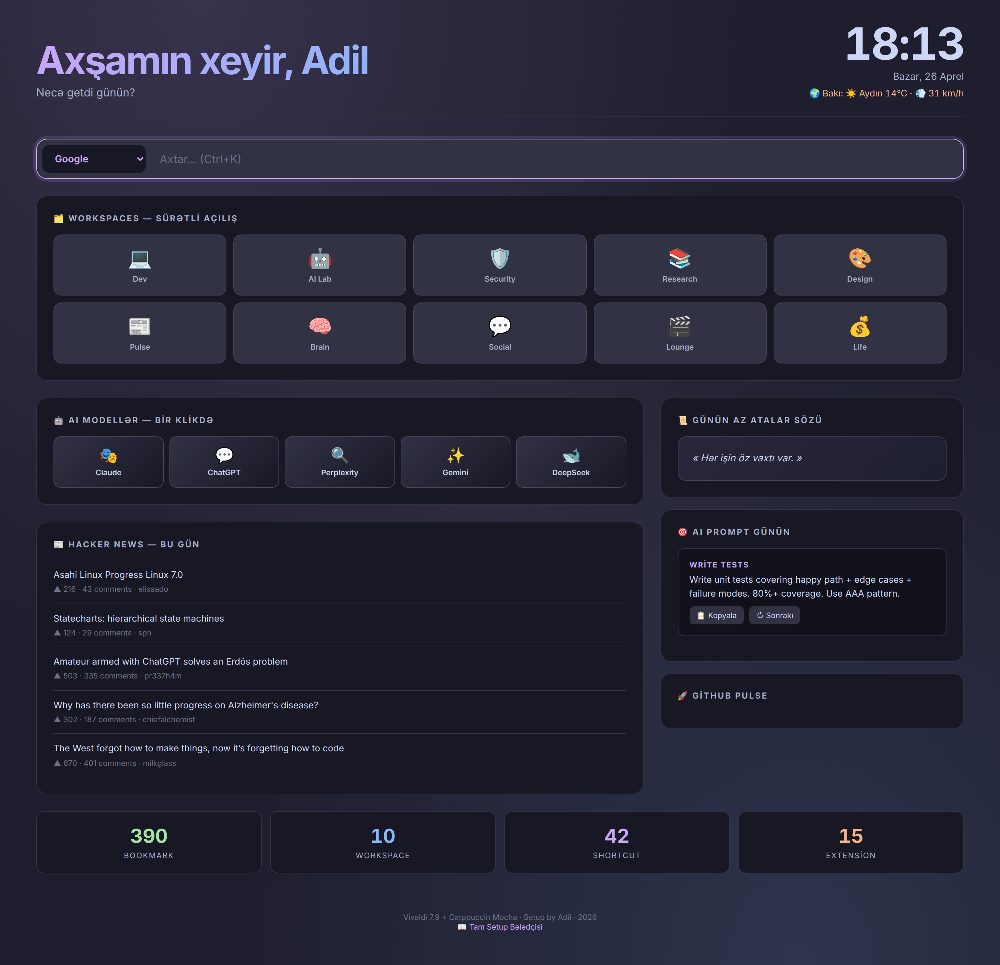
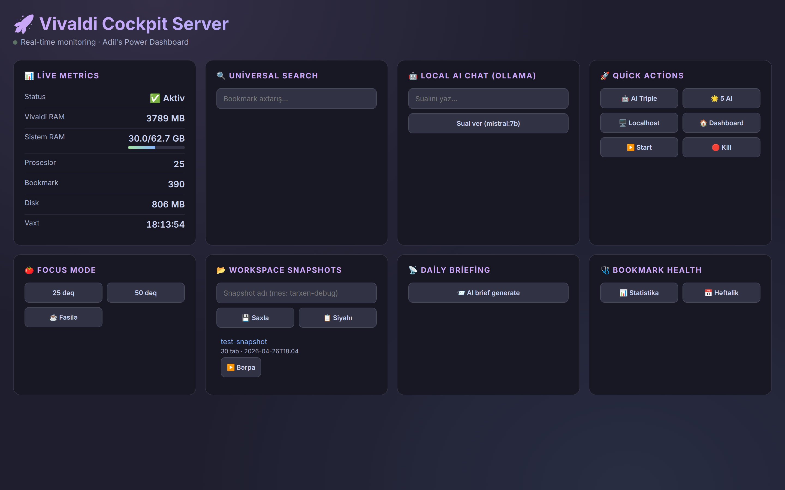
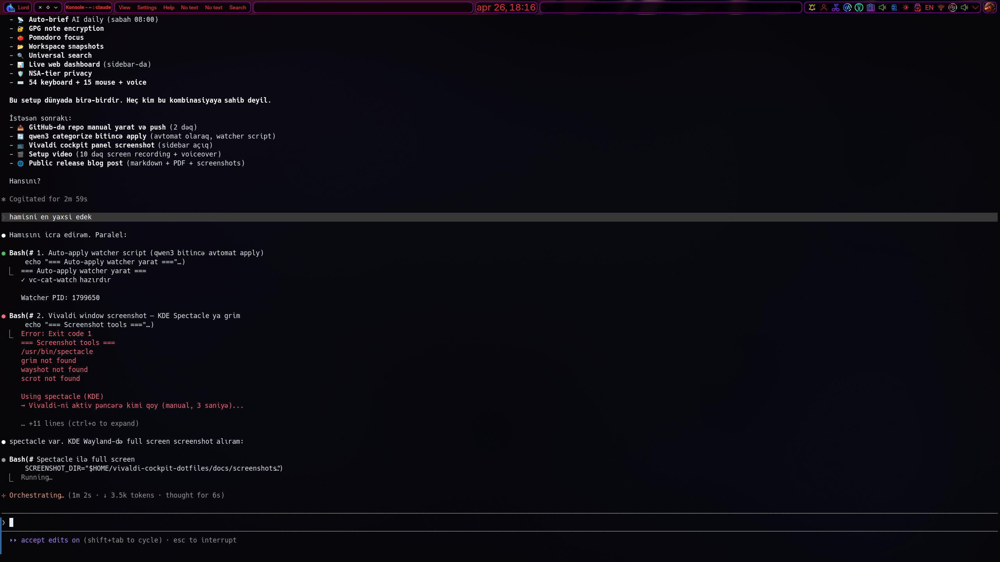

# 🚀 Vivaldi Cockpit — Adil's Legendary 2026 Setup

> **A complete browser power-user setup combining Vivaldi 7.9, Catppuccin Mocha,
> Azerbaijani UI, local AI, voice control, and a custom CLI dashboard.**


---

## 📸 Screenshots

### 🏠 Custom New Tab Dashboard
*Catppuccin Mocha · saata görə salamlama · live Bakı havası · HN top 5 · AZ atalar sözü · AI prompt günün*



### 🌐 vc-server Web Cockpit (localhost:8001)
*FastAPI + WebSocket · live metrics · universal search · AI chat · focus mode · workspace snapshots*



### 🖥️ Vivaldi Desktop View
*10 workspaces · 390 bookmarks · 13 sidebar panels · Catppuccin Mocha theme*



---

## ✨ Highlights

- **🇦🇿 Azerbaijani UI** + 6 native AZ notes + 18 proverbs in dashboard
- **🎨 17 custom CSS mods** — Catppuccin Mocha + glassmorphism + animations
- **🗂️ 10 emoji workspaces** — 390 organized URLs across logical domains
- **🤖 Local AI integration** — Ollama (9 models) via `vc-ask`
- **🎙️ Voice control** — speak commands in AZ/EN (`vc-voice`)
- **📊 Real-time monitoring** — btop-style cockpit (`vc-cockpit`)
- **🔍 Universal semantic search** — bookmarks + history + notes (`vc-find`)
- **🔐 GPG-encrypted notes** — ed25519 key (`vc enc`)
- **📅 Weekly auto-reports** — systemd timer + PDF export (`vc-weekly`)
- **🩺 Bookmark health checker** — parallel network validation
- **🛡️ NSA-tier privacy** — DoH, HTTPS-only, third-party cookie block
- **⌨️ 54 keyboard shortcuts** — F-keys for workspaces, panels, dev tools
- **🖱️ 15 mouse gestures** — including rocker gestures
- **📡 29 RSS feeds** — Hacker News, Phoronix, Krebs, Anthropic Research
- **🏠 Custom HTML dashboard** — clock, weather, HN top, AI prompts, projects

## 🎯 The `vc` CLI

Just type `v` in your terminal — interactive fzf menu opens with 26 commands.

```bash
v               # Interactive menu
vc-ask "..."    # Local AI conversation
vc-find ...     # Universal search
vc-cockpit      # Real-time monitor
vc-voice listen # Voice command (5sec)
vc-weekly --pdf # Generate report
```

## 📦 Components

| Path | Purpose |
|------|---------|
| `scripts/` | All `vc*` CLI tools (Python + Bash) |
| `vivaldi/User/custom.css` | 17 Catppuccin Mocha UI mods |
| `vivaldi/dashboard/` | Custom HTML new tab page |
| `systemd/` | Weekly health check timer |
| `fish/`, `bash/` | Shell aliases + welcome banner |
| `docs/` | Full setup guide (Azerbaijani + English) |

## 🚀 Installation

### One-line install (TÖVSİYƏ)

```bash
curl -sL https://raw.githubusercontent.com/DarkTLord/vivaldi-cockpit/main/update.sh | bash
```

### Manual

```bash
git clone https://github.com/DarkTLord/vivaldi-cockpit.git ~/vivaldi-cockpit
cd ~/vivaldi-cockpit
./install.sh
```

### Update / Upgrade

```bash
# Quick update (one-liner)
curl -sL https://raw.githubusercontent.com/DarkTLord/vivaldi-cockpit/main/update.sh | bash

# Manual
cd ~/vivaldi-cockpit
./install.sh --update
```

### Install modes

| Komanda | Nə edir |
|---------|---------|
| `./install.sh` | Yeni quraşdırma (idempotent) |
| `./install.sh --update` | Git pull + yeniləmə |
| `./install.sh --force` | Tam yenidən qurma |
| `./install.sh --scripts-only` | Yalnız `~/.local/bin/vc-*` |
| `./install.sh --help` | Yardım |

### Uninstall

```bash
rm -rf ~/.local/bin/vc* ~/.local/venvs/vc ~/.config/vc-aliases.sh
rm -rf ~/.config/fish/conf.d/vc.fish ~/.vivaldi-dashboard
rm -f ~/.config/vivaldi-cockpit-version
systemctl --user disable --now vivaldi-{health,brief}.timer
```

The installer will:
1. Symlink `scripts/*` → `~/.local/bin/`
2. Copy `vivaldi/User/custom.css` → `~/.config/vivaldi/User/`
3. Set up Vivaldi dashboard at `~/.vivaldi-dashboard/`
4. Install systemd timer for weekly health check
5. Source aliases in your shell config

## 🔧 Requirements

- **OS:** Arch Linux / Garuda / BlackArch (other distros likely work)
- **Browser:** Vivaldi 7.9+
- **Python:** 3.11+ with `rich`, `requests`, `weasyprint`, `markdown`, `reportlab`
- **AI:** Ollama (optional but recommended) for `vc-ask`
- **Voice:** yappie / wiggly-stt / nerd-dictation (optional, AUR)
- **GPG:** for encrypted notes

## 📜 License

MIT © Adil (DarkTLord) · 2026

## 🤝 Contributing

This is a personal setup but feel free to fork, adapt, and PR improvements.
